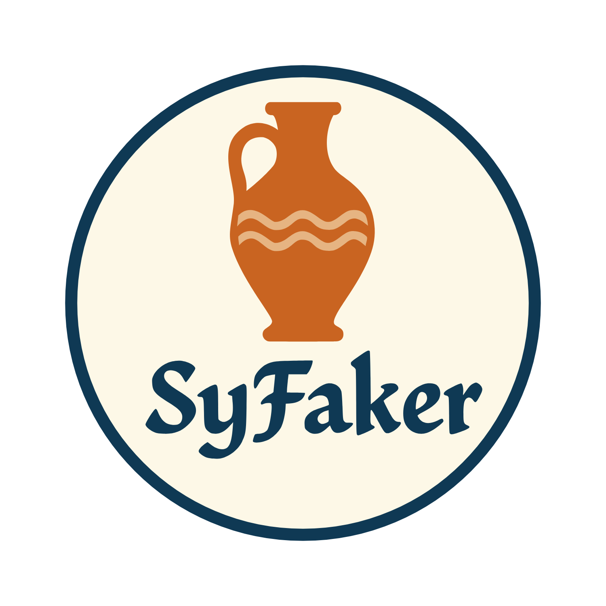

# SyFaker



حزمة PHP لتوليد بيانات سورية واقعية زائفة — أسماء، عناوين، نصوص والمزيد. مصممة للعمل مع Laravel من الإصدار 8 إلى 12، وتوفر محتوى أصيلًا باللهجة السورية من شوارع دمشق إلى أسماء حلبية. مثالية للاختبارات، ملء قواعد البيانات، أو محتوى مؤقت بنكهة محلية.

## الفهرس
1. [الميزات](#الميزات)
1. [التثبيت](#التثبيت)
1. [الاستخدام](#الاستخدام)
    1. [الاستخدام مع Laravel](#الاستخدام-مع-laravel)
1. [واجهة البرمجة(API)](#واجهة-البرمجة-api)
1. [التوافق مع Laravel و PHP](#-التوافق-مع-laravel-و-php)
1. [الرخصة](#الرخصة)
1. [ملف الاستخدام باللغة الانكليزية](./README.md)

## الميزات
- نصوص وفقرة باللهجة السورية
- أسماء سورية
- عناوين سورية
- أرقام هواتف سورية (موبايل، أرضي، سيريتل، MTN)
- نصوص باللهجة السورية
- تواريخ ميلادية وهجرية بتنسيق سوري
- أسماء شركات، مسميات وظيفية، وأنواع أنشطة تجارية سورية
- أطعمة، أمثال، حكم، وعناصر تراثية سورية
- واجهة استخدام مشابهة لـ Faker


## التثبيت
```bash
composer require bit/sy-faker
```

## الاستخدام
```php
use Bit\SyFaker\SyFaker;

$syFaker = new SyFaker();

// النصوص والفقرات
$faker->word(); // مثل: "مبسوط", "إيمتى", "سوريا", "رفيق", "عنجد"
$faker->words(5); // مثل: "مرحبا كيفك عنجد شوي منيح"
$faker->words(5, true); // مثل: ['مرحبا', 'كيفك', 'عنجد', 'شوي', 'منيح']
$faker->sentences(2); // مثل: "شو صاير معك؟ العمل الجاد يؤدي إلى النجاح."
$faker->sentences(2, 'msa', false, ' | '); // مثل: "ذهبت إلى السوق | إن التعليم هو أساس تقدم الأمم."
$faker->sentence(); // مثل: "شو صاير معك؟"
$faker->sentence('msa'); // مثل: "ذهبت إلى السوق لشراء بعض الحاجيات."
$faker->sentence('dialect'); // مثل: "خلص بكفي لهون."
$faker->paragraph(); // الوضع الافتراضي مختلط
$faker->paragraph(4, 6, 'msa'); // فقط العربية الفصحى
$faker->paragraph(5, 8, 'dialect'); // فقط اللهجة السورية

// الأسماء
$faker->name(); // مثل: "علي الحلبي"
$faker->firstName(); // مثل: "مريم"
$faker->lastName(); // مثل: "الدمشقي"

// العناوين
$faker->address(); // مثل: "دمشق، المزة، شارع الحمرا، بناء رقم 12"

// أرقام الهواتف
$faker->mobile(); // مثل: "+963 93 123 4567"
$faker->mobile(false); // مثل: "093 123 4567"
$faker->mobile(true, 'syriatel'); // مثل: "+963 93 123 4567"
$faker->mobile(true, 'mtn'); // مثل: "+963 94 123 4567"
$faker->syriatel(); // مثل: "+963 93 123 4567"
$faker->mtn(); // مثل: "+963 94 123 4567"
$faker->landline(); // مثل: "+963 11 123 4567"
$faker->landline(false); // مثل: "011 123 4567"

// التواريخ
$faker->gregorianDate(); // مثل: "22/07/2025"
$faker->hijriDate();     // مثل: "16/01/1447"
$faker->randomGregorianDate('-2 years', 'now'); // مثل: "05/06/2023"
$faker->randomhijriDateDate('-2 years', 'now'); // مثل: "15/02/1445"

// الشركات
$faker->companyName();  // مثل: "شركة النور محدودة المسؤولية"
// المهن
$faker->jobTitle();     // مثل: "مهندس برمجيات"
// الأنشطة التجارية
$faker->businessType(); // مثل: "تكنولوجيا المعلومات"
// المأكولات
$faker->food();            // مثل: "شيش برك"
// الأمثال الشعبية
$faker->idiom();           // مثل: "بيضحك عالمشنقة"
// الحكم الشعبية
$faker->proverb();         // مثل: "كل تأخيرة فيها خيرة"
// عناصر تراثية
$faker->traditionalItem(); // مثل: "مروحة يدوية"
// جملة تجمع المأكولات، الأمثال، الحكم، والعناصر التراثية
$faker->culturalSentence(); // مثل: وأنت عم تاكل محشي كوسا جنب صابون الغار، تذكّر المثل الشامي: "كل تأخيرة فيها خيرة".

```

### الاستخدام مع Laravel
الحزمة تسجل نفسها تلقائيًا عبر ServiceProvider، وتوفر دالة مساعدة:
```php
use Bit\SyFaker\SyFaker;

$syFaker = new SyFaker();

// أو يمكنك استخدام الدالة المساعدة مباشرة:
syFaker()->name();

```
## واجهة البرمجة (API)
- `$faker->letter()`
- `$faker->word()`
- `$faker->words($count = 5, $asArray = false, $separator = ' ')`
- `$faker->sentence($mode = 'mixed')`
- `$faker->sentences($count = 3, $mode = 'mixed', $asArray = false, $separator = ' ')`
- `$faker->paragraph($min = 3, $max = 7, $mode = 'mixed')`
- `$faker->name($gender = null)`
- `$faker->firstName($gender = null)`
- `$faker->lastName()`
- `$faker->address()`
- `$faker->mobile($withCountryCode = true, $company = null)`
- `$faker->syriatel($withCountryCode = true)`
- `$faker->mtn($withCountryCode = true)`
- `$faker->landline($withCountryCode = true)`
- `$faker->gregorianDate($format = 'd/m/Y')`
- `$faker->hijriDate($format = 'd/m/Y')`
- `$faker->randomGregorianDate($start = '-10 years', $end = 'now', $format = 'd/m/Y')`
- `$faker->randomHijriDate($start = '-10 years', $end = 'now', $format = 'd/m/Y')`
- `$faker->companyName()`
- `$faker->jobTitle()`
- `$faker->businessType()`
- `$faker->food()`
- `$faker->idiom()`
- `$faker->proverb()`
- `$faker->traditionalItem()`
- `$faker->culturalSentence()`

## ✅ التوافق مع Laravel و PHP

| Laravel Version | PHP 7.4 | PHP 8.0 | PHP 8.1 | PHP 8.2 | PHP 8.3 | PHP 8.4 |
|-----------------|---------|---------|---------|---------|---------|---------|
| Laravel 8       | ✅      | ✅      | ✅      | ✅      | ❌      | ❌      |
| Laravel 9       | ❌      | ✅      | ✅      | ✅      | ✅      | ❌      |
| Laravel 10      | ❌      | ✅      | ✅      | ✅      | ✅      | ✅      |
| Laravel 11      | ❌      | ❌      | ✅      | ✅      | ✅      | ✅      |
| Laravel 12      | ❌      | ❌      | ✅      | ✅      | ✅      | ✅      |


> ❌ = غير مدعوم
> ✅ = مدعوم بالكامل


## الرخصة
MIT 
